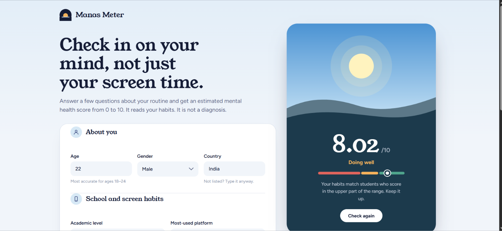

# Manas Meter

Estimate a student's mental health score (0–10) from their screen time, sleep, study, exercise and stress.

Manas Meter is a small machine learning web app. You fill in a short form, and a Random Forest model trained on 5,000 student records returns an estimated score. The result is shown as a sun that rises higher the better the score.

> **Not a medical tool.** The score is an estimate based on habits. It is not a diagnosis. If you are struggling, please talk to someone you trust or a qualified professional.




## Features

- Clean, responsive interface (works on phone and desktop)
- Predicts a mental health score from 12 inputs
- Score bands: **Under strain** (below 5), **Fairly balanced** (5 to 7), **Doing well** (7 and above)
- Form and server-side validation with clear error messages
- Notes when an answer falls outside the range the model was trained on
- REST API built with FastAPI

## How it works

1. The form in `index.html` sends your answers to the API (`POST /predict`).
2. `main.py` validates them and cleans up the country name.
3. The saved model (`Mental_Health_Model.pkl`) predicts a score.
4. The page shows the score, a short explanation and any notes.

## Tech stack

| Part | Tools |
|------|-------|
| Frontend | HTML, CSS, JavaScript |
| Backend | Python, FastAPI, Pydantic |
| Model | scikit-learn (Random Forest regressor), pandas |
| Data | Student Social Media And Mental Health Impact dataset (5,000 rows) |

## Model performance

Trained in `ML_Project.ipynb`, with a 70/30 train-test split:

| Model | R² (test) | MAE |
|-------|-----------|-----|
| Linear Regression | 0.74 | 0.54 |
| **Random Forest (saved model)** | **0.88** | **0.35** |

The MAE of 0.35 means predictions are off by about a third of a point on average.

## Inputs

| Field | Description |
|-------|-------------|
| `age` | Age in years |
| `gender` | Male or Female |
| `country` | Any country (unlisted countries are grouped as "Other") |
| `academic_level` | High School, Undergraduate or Graduate |
| `most_used_platform` | Instagram, TikTok, YouTube, WhatsApp and others |
| `purpose_of_use` | Networking, Education, Entertainment or News |
| `avg_daily_usage_hours` | Daily screen time in hours |
| `daily_unlocks` | Phone unlocks per day |
| `study_hours` | Study hours per day |
| `physical_activity_hours` | Exercise hours per day |
| `sleep_hours_per_night` | Sleep hours per night |
| `stress_level` | Low, Medium, High or Very High |

## Run it locally

**1. Clone and install**

```bash
git clone https://github.com/Mayurkale2402/Manas_meter.git
cd Manas_meter
pip install -r requirements.txt
```

**2. Start the API**

```bash
uvicorn main:app --reload
```

The API runs at `http://127.0.0.1:8000`. Interactive docs are at `/docs`.

**3. Open the frontend**

In `script.js`, set `API_BASE` to `http://127.0.0.1:8000`, then open `index.html` in your browser.

## API

**`POST /predict`**

Example request:

```json
{
  "age": 21,
  "gender": "Female",
  "country": "India",
  "academic_level": "Undergraduate",
  "most_used_platform": "Instagram",
  "purpose_of_use": "Entertainment",
  "avg_daily_usage_hours": 5,
  "daily_unlocks": 170,
  "study_hours": 3,
  "physical_activity_hours": 1.7,
  "sleep_hours_per_night": 6.6,
  "stress_level": "Medium"
}
```

Example response:

```json
{
  "predicted_mental_health_score": 6.26,
  "notes": []
}
```

`notes` lists plain-language cautions, for example when an input is outside the range the model learned from.

## Project structure

```
├── index.html                 # Frontend page
├── style.css                  # Styling
├── script.js                  # Form logic and API calls
├── main.py                    # FastAPI app
├── scoring_rules.py           # Country matching and input checks
├── Mental_Health_Model.pkl    # Trained model
├── ML_Project.ipynb           # Data analysis and model training
├── Student Social Media And Mental Health Impact.csv
└── requirements.txt
```

## Limitations

- The model was trained on students aged **18–24**, with **62–273 phone unlocks a day**. Answers outside the trained ranges are treated like the nearest value the model knows.
- Screen time and sleep drive most of the prediction. **Stress level has very little effect** on the score, because of how it relates to the other features in this dataset.
- The dataset is a single collection of records, so results may not generalise to every group of students.
- The model was saved with scikit-learn 1.9.0, so keep that version pinned.

## Author

Made by **<Mayur Kale>** · [GitHub](https://github.com/Mayurkale2402)
